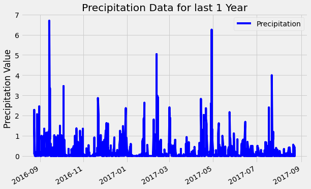
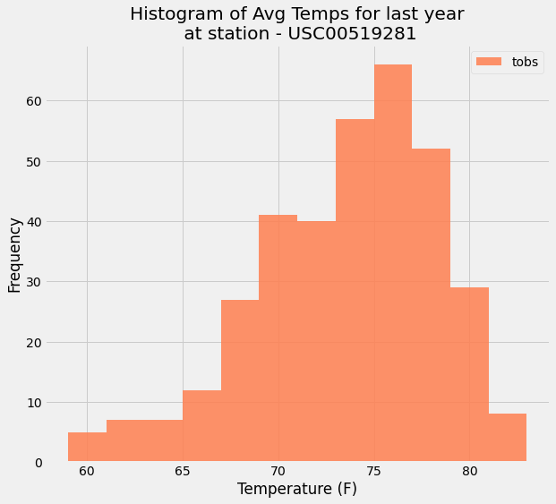

# Climate Analysis

#### Objective: 
- Use Python and SQLAlchemy ORM queries with provided [hawaii.sqlite](Resources/hawaii.sqlite) to reflect tables into a new model and perform analysis of Hawaii climate.
- Build a Flask Web app using the served queries that will return JSONified query results from API endpoints.

Technologies Used: `SQLAlchemy`, `Pandas`, `Matplotlib` and `FLASK`

This challenge is done in 2 steps:
- Climate Analysis using SQLAlchemy and Python - [Climate_Analysis.ipynb](Climate_Analysis.ipynb)
- Design a Flask API Web Climate App 
- - -
## Step 1 - Climate Analysis and Exploration

To begin, use Python and SQLAlchemy to do basic climate analysis and data exploration of your climate database. All of the following analysis should be completed using SQLAlchemy ORM queries, Pandas, and Matplotlib.

Set-up:
* Used SQLAlchemy `create_engine` to connect to your sqlite database.
* Used SQLAlchemy `automap_base()` to reflect your tables into classes and save a reference to those classes called `Station` and `Measurement`.

### Precipitation Analysis

* Designed a query to retrieve the last 12 months of precipitation data.
* Filtered only the `date` and `prcp` values.
* Loaded the query results into a Pandas DataFrame and set the index to the date column.
* Sorted the DataFrame values by `date`.
* Plot the results using the DataFrame `plot` method.
* Used Pandas to print the summary statistics for the precipitation data.
    

### Station Analysis

* Designed a query to calculate the total number of stations.
* Designed a query to find the most active stations.
* Listed the stations and observation counts in descending order.
* Found out which station has the highest number of observations.
* Designed a query to retrieve the last 12 months of temperature observation data (tobs).
* Filter by the station with the highest number of observations.
* Plot the results as a histogram with `bins=12`.
    

### Navi Sohi | Data Analytics & Visualization
